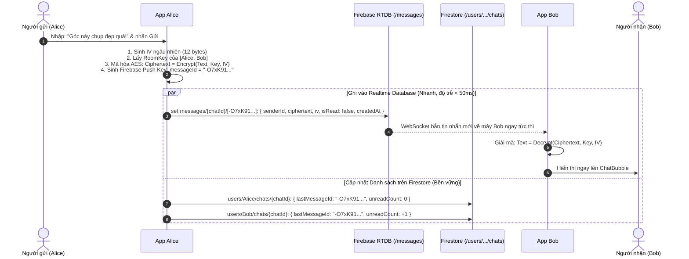

# 📋 Bản Đặc Tả Kỹ Thuật (Technical Specification)

## Tính Năng: Kiến Trúc Nhắn Tin Hybrid (Firestore + Realtime Database) & Mã Hóa Dữ Liệu (SnapStep)

- **Trạng thái:** Đã phê duyệt (Approved)
- **Ngày cập nhật:** 13/09/2026
- **Tác giả:** Đội ngũ Kỹ thuật SnapStep
- **Phạm vi áp dụng:** Tin nhắn trò chuyện 1-1 (Direct Message) giữa 2 người bạn đồng hành.

---

## 1. Mục Tiêu & Yêu Cầu Cốt Lõi (Objective)

1. **Mô hình Hybrid Tối Ưu (Hybrid Database Architecture):**
   - **Cloud Firestore:** Quản lý danh sách hộp thư hội thoại (`user_chats`) dưới hồ sơ của từng người dùng, hỗ trợ truy vấn sắp xếp `updatedAt` mượt mà, phân quyền bảo mật riêng tư tuyệt đối.
   - **Firebase Realtime Database (RTDB):** Lưu trữ toàn bộ các luồng tin nhắn trực tiếp (`messages`), tận dụng kết nối WebSocket siêu tốc với độ trễ thấp (< 50ms) và tối ưu hóa chi phí đọc/ghi dữ liệu.
2. **Quy Chuẩn Định Danh Bằng Firebase Push Key:**
   - Sử dụng **Firebase Push Key** (sinh ra bởi `.push().key`, ví dụ `-O7xK91aBcDeFgHiJ`) làm `messageId` cho từng tin nhắn trên RTDB và lưu trực tiếp vào trường `lastMessageId` trên Firestore.
   - **Lợi ích vượt trội:** Sinh ngay tức thì trên Client (in-memory) không cần chờ mạng, tự động sắp xếp theo thứ tự thời gian (Chronologically ordered), và chống trùng lặp tuyệt đối.
3. **Bảo mật Dữ liệu (Zero-Knowledge Storage):**
   - Toàn bộ nội dung tin nhắn (`text`) và tin nhắn xem trước gần nhất (`lastMessage`) lưu trên cả RTDB và Firestore đều ở dạng chuỗi bản mã vô nghĩa (`ciphertext`).
   - Quản trị viên Firebase hay bên thứ ba tấn công vào cơ sở dữ liệu đều **không thể đọc được nội dung tin nhắn**.
4. **Phản hồi Khoảnh khắc (Snap Reply):** Cho phép trích dẫn hình ảnh bài viết Snap (tỉ lệ 3:4, địa điểm, chú thích) đi kèm tin nhắn phản hồi.
5. **Trải nghiệm mượt mà:** Người dùng không bị mất lịch sử tin nhắn khi chuyển đổi hoặc đăng nhập lại thiết bị.

---

## 2. Lựa Chọn Kiến Trúc Mã Hóa (Crypto Architecture)

### 2.1. Phương Án Lựa Chọn: AES-256-GCM / CTR + HMAC (Shared Room Key)

- **Thuật toán mã hóa:** Chuẩn công nghiệp AES (Advanced Encryption Standard) 256-bit kết hợp chế độ GCM hoặc CTR + HMAC-SHA256 để bảo vệ tính bí mật và toàn vẹn dữ liệu.
- **Cơ chế sinh khóa (Key Derivation):**
  - Khóa phòng chat (`RoomKey`) được phái sinh từ UID của 2 người tham gia qua thuật toán PBKDF2:  
    `RoomKey = PBKDF2(secret: sort(uidA, uidB).join(':'), salt: APP_SALT, iterations: 10000, keyLen: 32)`
  - Khóa này chỉ được tính toán cục bộ (in-memory) trên thiết bị của `uidA` và `uidB`, **tuyệt đối không bao giờ gửi khóa lên bất kỳ Database nào**.
- **Vector khởi tạo (IV - Initialization Vector):** Mỗi tin nhắn sinh một IV ngẫu nhiên duy nhất (12 bytes Base64), đảm bảo 2 tin nhắn giống hệt nhau khi mã hóa sẽ cho ra 2 bản mã hoàn toàn khác biệt.

---

## 3. Thiết Kế Cơ Sở Dữ Liệu Hybrid (Database Schema)

### 3.1. Quy ước đặt tên ID phòng chat (Deterministic Chat ID)

Phòng chat giữa 2 người luôn có `chatId` duy nhất được ghép từ 2 UID theo thứ tự bảng chữ cái:

```typescript
export const getChatRoomId = (uid1: string, uid2: string): string => {
  return [uid1, uid2].sort().join("_");
};
```

---

### 3.2. Trên Cloud Firestore: Danh sách Hội thoại của User (`users/{userId}/chats/{chatId}`)

Mỗi người dùng sở hữu danh sách hộp thư riêng biệt, chỉ tải tóm tắt các cuộc trò chuyện của chính mình:

```typescript
import { Timestamp, FieldValue } from "@react-native-firebase/firestore";

export interface UserChatSummaryFirestore {
  chatId: string; // ID phòng chat = [uidA, uidB].sort().join('_')
  recipientId: string; // UID của người bạn trò chuyện
  lastMessageId: string; // 👈 Firebase Push Key của tin nhắn gần nhất bên RTDB (vd: "-O7xK91aBcDeFgHiJ")
  lastMessageCiphertext: string; // Bản mã của tin nhắn gần nhất (hiển thị xem trước ở Inbox)
  lastMessageIv: string; // IV để giải mã tin nhắn gần nhất
  lastSenderId: string; // UID người gửi tin cuối
  unreadCount: number; // Số lượng tin nhắn chưa đọc của riêng user này
  updatedAt: Timestamp | FieldValue; // Thời gian gửi tin cuối (dùng để orderBy sắp xếp danh sách)
}
```

- **Câu truy vấn trên Tab Friends:**
  ```typescript
  firestore()
    .collection("users")
    .doc(currentUserId)
    .collection("chats")
    .orderBy("updatedAt", "desc");
  ```

---

### 3.3. Trên Firebase Realtime Database: Luồng Tin Nhắn (`messages/{chatId}/{messageId}`)

Lưu trữ toàn bộ tin nhắn chi tiết theo từng phòng chat, sử dụng Firebase Push Key làm `messageId`:

```typescript
export interface ChatReplyPostMetadata {
  postId: string;
  imageUrl: string;
  caption?: string;
  locationName?: string;
}

export interface ChatMessageRTDB {
  senderId: string; // UID người gửi
  receiverId: string; // UID người nhận
  ciphertext: string; // Nội dung tin nhắn đã mã hóa (chuỗi Base64)
  iv: string; // Initialization Vector (12 bytes Base64)
  replyPost?: ChatReplyPostMetadata | null; // Dữ liệu ảnh Snap trích dẫn nếu có
  isRead: boolean; // Trạng thái đã xem
  createdAt: number; // Timestamp mili-giây từ Server (database.ServerValue.TIMESTAMP)
}
```

- **Cơ chế tạo Push Key & Ghi dữ liệu đồng thời:**

  ```typescript
  // 1. Sinh Push Key trên Client ngay lập tức (không cần chờ network)
  const newMsgRef = database().ref(`messages/${chatId}`).push();
  const messageId = newMsgRef.key; // vd: "-O7xK91aBcDeFgHiJ"

  // 2. Ghi tin nhắn vào Realtime Database với messageId này
  await newMsgRef.set(messageData);

  // 3. Cập nhật lastMessageId = messageId lên Firestore của cả người gửi và người nhận
  await updateFirestoreSummaries(chatId, messageId, ciphertext, iv);
  ```

- **Lắng nghe tin nhắn trên `ChatScreen`:**
  ```typescript
  database().ref(`messages/${chatId}`).limitToLast(20); // Chỉ tải 20 tin nhắn gần nhất khi mới vào phòng
  ```

---

## 4. Luồng Xử Lý Mã Hóa & Gửi Nhận Tin Nhắn (Data Flow)



---

## 5. Kế Hoạch Phân Bổ Tệp Tin (File Manifest)

| Tệp tin                         |   Trạng thái    | Nhiệm vụ                                                                                                                    |
| :------------------------------ | :-------------: | :-------------------------------------------------------------------------------------------------------------------------- |
| `src/services/cryptoService.ts` |   **TẠO MỚI**   | Hàm mã hóa `encryptMessage()`, giải mã `decryptMessage()`, và phái sinh khóa phòng `deriveChatRoomKey()`.                   |
| `src/services/chatService.ts`   |  **CẬP NHẬT**   | Các hàm nghiệp vụ: sinh Push Key `push().key`, ghi RTDB `messages`, cập nhật Firestore `lastMessageId`, lắng nghe realtime. |
| `src/screens/ChatScreen.tsx`    |  **CẬP NHẬT**   | Lắng nghe nhánh RTDB `messages/{chatId}` và tự động mã hóa/giải mã khi chat.                                                |
| `src/screens/FriendsScreen.tsx` |  **CẬP NHẬT**   | Lắng nghe collection Firestore `users/{myUid}/chats` để hiển thị danh sách hội thoại xem trước.                             |
| `docs/CHAT_ENCRYPTION_SPEC.md`  | **ĐÃ CẬP NHẬT** | Bản đặc tả kỹ thuật mô hình Hybrid & Firebase Push Key đã được phê duyệt.                                                   |

---

## 6. Kịch Bản Kiểm Thử & Nghiệm Thu (Test Plan)

### 6.1. Kiểm thử Thuật toán Mã hóa (Crypto Unit Tests)

- [x] **Tính đối xứng:** `decrypt(encrypt(text, key, iv), key, iv) === text` với 100% các loại chuỗi (tiếng Việt có dấu, emoji 😄🚀, ký tự đặc biệt).
- [x] **Chống trùng lặp bản mã:** Cùng 1 nội dung text gửi 2 lần liên tiếp phải sinh ra 2 bản mã `ciphertext` hoàn toàn khác nhau do IV khác nhau.

### 6.2. Kiểm thử Cơ sở dữ liệu & Push Key (Database Verification)

- [ ] **Push Key đồng nhất:** Kiểm tra `key` của tin nhắn trong RTDB và `lastMessageId` trong Firestore `users/{uid}/chats/{chatId}` phải **trùng khớp 100%** (ví dụ cùng là `-O7xK91aBcDeFgHiJ`).
- [ ] **Bảo mật tuyệt đối:** Cả trường `ciphertext` bên RTDB và `lastMessageCiphertext` bên Firestore đều chỉ hiển thị chuỗi Base64 vô nghĩa, không lộ dữ liệu gốc.

### 6.3. Kiểm thử Trải nghiệm Người dùng (E2E User Flow)

- [ ] Alice gửi &rarr; Bob nhận realtime từ RTDB trong < 100ms.
- [ ] Danh sách Friends trên Firestore tự động nhảy lên đầu và hiển thị số tin nhắn chưa đọc (`unreadCount = 1`).
- [ ] Khi Bob mở phòng chat, `unreadCount` trên Firestore tự động reset về 0 và tin nhắn cuối `isRead` bên RTDB được đánh dấu `true`.

---

## 7. Ranh Giới Kỹ Thuật (Engineering Boundaries)

- 🔒 **Bảo mật tuyệt đối:** Không bao giờ lưu trữ secret key hoặc khóa giải mã dưới dạng văn bản rõ (plaintext) lên Firestore hay Realtime Database.
- 🔑 **Cơ chế Push Key:** Luôn sinh key ở phía Client bằng `.push().key` để có ID lập tức đồng bộ sang Firestore mà không gây nghẽn luồng xử lý.
- 📐 **Kiến trúc Clean Architecture:**
  - Logic mã hóa tập trung hoàn toàn trong `src/services/cryptoService.ts`.
  - Logic kết nối mạng Hybrid tập trung hoàn toàn trong `src/services/chatService.ts`.
  - UI Component (`ChatScreen`, `ChatBubble`) chỉ nhận dữ liệu đã giải mã để hiển thị.
- 🇻🇳 **Tiêu chuẩn AGENTS.md:** 100% Zero `any`, comment giải thích code bằng tiếng Việt, màu sắc lấy từ `Colors.ts`.
