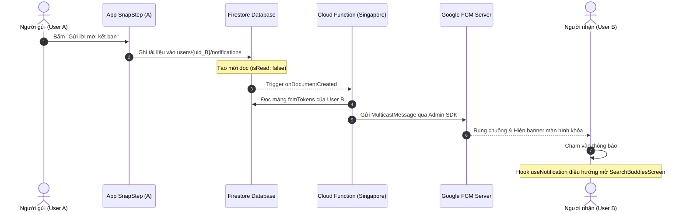
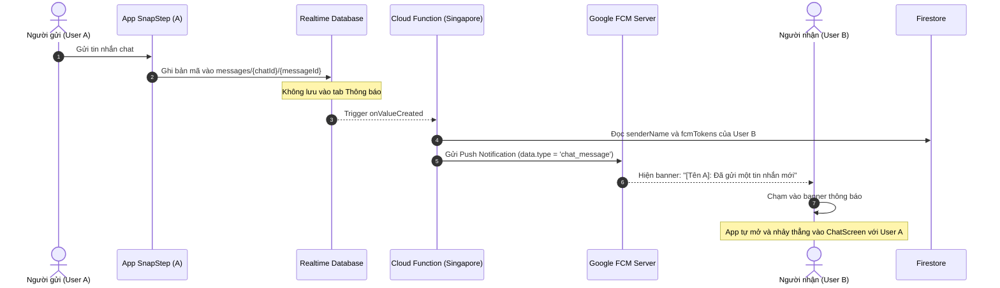

# 📋 Bản Đặc Tả Kỹ Thuật (Technical Specification)

## Tính Năng: Hệ Thống Thông Báo Đẩy (FCM) & Thông Báo Nội Ứng Dụng (SnapStep)

- **Trạng thái:** Đã triển khai & Đang hoạt động (Deployed to Production)
- **Ngày cập nhật:** 29/09/2026
- **Tác giả:** Đội ngũ Kỹ thuật SnapStep
- **Phạm vi áp dụng:** Toàn bộ ứng dụng (Tin nhắn Chat, Lời mời kết bạn, Bài đăng check-in mới, Nhắc nhở streak).

---

## 1. Mục Tiêu & Triết Lý Thiết Kế (Objective & Philosophy)

1. **Phân tách rành mạch trải nghiệm người dùng (Clean UX Separation):**
   - **Tab Thông báo (In-App Notification Feed):** Chỉ dành riêng cho các tương tác xã hội (`friend_request`, `friend_accepted`, `new_snap`, `streak_reminder`).
   - **Tin nhắn trò chuyện (Chat Messages):** Tuyệt đối **không lưu vào tab Thông báo** để tránh gây "rác" thông báo. Thay vào đó, tin nhắn vẫn đẩy Push Notification ra màn hình khóa và khi người dùng chạm vào sẽ điều hướng thẳng vào phòng chat tương ứng.
2. **Kiến trúc Serverless Bảo Mật Tuyệt Đối (Zero-Secret Client):**
   - Ứng dụng di động **không bao giờ nhúng Service Account Key** của Firebase để tự gửi FCM.
   - Toàn bộ việc phân phối thông báo đẩy ra màn hình khóa được giao cho **Firebase Cloud Functions 2nd Gen** (Node.js 24) kích hoạt tự động theo sự kiện Database.
3. **Độ Trễ Thấp & Đồng Bộ Vùng (Low Latency):**
   - Đặt Cloud Functions cùng cụm máy chủ với cơ sở dữ liệu: vùng **`asia-southeast1` (Singapore)**.
4. **Hỗ Trợ Toàn Diện 3 Trạng Thái Thiết Bị (Device States):**
   - **Cold Start (App bị tắt hoàn toàn):** Mở app và điều hướng an toàn tới màn hình đích.
   - **Background (App đang chạy ngầm):** Hiển thị Heads-up banner trên màn hình khóa.
   - **Foreground (App đang mở):** Tiếp nhận sự kiện mượt mà mà không làm gián đoạn trải nghiệm người dùng.
5. **Cơ Chế Tự Phục Hồi (Self-Healing Token Cleanup):**
   - Tự động xóa các FCM Token đã bị gỡ cài đặt app hoặc hết hạn khỏi Firestore, đảm bảo cơ sở dữ liệu luôn tinh gọn.

---

## 2. Kiến Trúc Luồng Dữ Liệu (End-to-End Architecture)

### 2.1. Luồng Thông Báo Tương Tác Xã Hội (Social Notifications)
Áp dụng cho: Lời mời kết bạn (`friend_request`), Đồng ý kết bạn (`friend_accepted`), Bài đăng mới (`new_snap`).



---

### 2.2. Luồng Thông Báo Tin Nhắn Trực Tiếp (Chat Notifications)
Áp dụng cho: Tin nhắn văn bản mã hóa AES, Ảnh trích dẫn Snap (`replyPost`).



---

## 3. Thiết Kế Cơ Sở Dữ Liệu & Schema (Database Schema)

### 3.1. Danh Sách Token Thiết Bị (`users/{userId}`)
Mỗi tài khoản lưu trữ danh sách các thiết bị đang đăng nhập bằng mảng chuỗi `fcmTokens`:

```typescript
// Đường dẫn: users/{userId}
export interface UserProfileFirestore {
  uid: string;
  displayName: string;
  email: string;
  avatarUrl?: string;
  fcmTokens?: string[]; // Danh sách token FCM của các máy user đăng nhập
  updatedAt: Timestamp | FieldValue;
}
```

### 3.2. Subcollection Hộp Thư Thông Báo (`users/{userId}/notifications/{notificationId}`)
Lưu trữ toàn bộ danh sách thông báo hiển thị tại màn hình [NotificationsScreen.tsx](file:///home/nguyensonhoang/Projects/snapstep-mobile/src/screens/NotificationsScreen.tsx):

```typescript
export type NotificationType =
  | 'chat_message'      // Có tin nhắn mới (chỉ dùng trong FCM Payload)
  | 'friend_request'   // Lời mời kết bạn mới
  | 'friend_accepted'  // Bạn bè đã chấp nhận kết bạn
  | 'new_snap'         // Bạn bè đăng bài check-in mới
  | 'streak_reminder' // Nhắc nhở duy trì chuỗi khám phá
  | 'other';

export interface NotificationItem {
  id: string;                          // Document ID Firestore
  type: NotificationType;              // Phân loại thông báo
  title: string;                       // Tiêu đề: "Lời mời kết bạn mới"
  body: string;                        // Nội dung hiển thị
  senderId?: string;                   // UID người tạo tương tác
  senderName?: string;                 // Tên người tạo tương tác
  senderAvatar?: string;               // URL ảnh đại diện
  chatId?: string;                     // ID phòng chat (nếu có)
  postId?: string;                     // ID bài viết (nếu có)
  isRead: boolean;                     // Trạng thái đã xem
  createdAt: Timestamp | FieldValue;   // Mốc thời gian tạo
}
```

---

## 4. Tầng Native & Cấu Hình Dự Án

### 4.1. Cấu hình [app.json](file:///home/nguyensonhoang/Projects/snapstep-mobile/app.json)
* **Quyền Android:** Khai báo quyền bắt buộc trên Android 13+ (API 33):
  ```json
  "permissions": [
    "android.permission.POST_NOTIFICATIONS"
  ]
  ```
* **Plugin Native:** Đăng ký plugin Firebase Messaging và bật liên kết tĩnh iOS:
  ```json
  "plugins": [
    "@react-native-firebase/app",
    "@react-native-firebase/auth",
    "@react-native-firebase/messaging",
    [
      "expo-build-properties",
      {
        "ios": {
          "useFrameworks": "static",
          "forceStaticLinking": ["RNFBApp", "RNFBAuth", "RNFBFirestore", "RNFBMessaging"]
        }
      }
    ]
  ]
  ```

### 4.2. Cầu nối JDK 17 trong [android/gradle.properties](file:///home/nguyensonhoang/Projects/snapstep-mobile/android/gradle.properties)
Do hệ thống sử dụng OpenJDK 25, CMake NDK của React Native và Worklets yêu cầu JDK 17 LTS để biên dịch thành công:
```properties
org.gradle.java.home=/home/nguyensonhoang/.jdks/jdk-17
```

### 4.3. Xử lý Chạy Ngầm tại Entry Point [index.ts](file:///home/nguyensonhoang/Projects/snapstep-mobile/index.ts)
Đăng ký `setBackgroundMessageHandler` trước khi `registerRootComponent(App)` để tiếp nhận thông báo khi app đang ẩn:
```typescript
import { getMessaging } from '@react-native-firebase/messaging';

getMessaging().setBackgroundMessageHandler(async (remoteMessage) => {
  console.log('[Background FCM Message]:', remoteMessage);
});
```

---

## 5. Tầng Ứng Dụng Client (React Native)

### 5.1. Service Thông Báo: [src/services/notificationService.ts](file:///home/nguyensonhoang/Projects/snapstep-mobile/src/services/notificationService.ts)
* `requestUserPermission()`: Tự động phân nhánh xin quyền phù hợp (Android `POST_NOTIFICATIONS`, iOS `requestPermission`).
* `syncFCMToken(uid)`: Lấy token của máy và cập nhật vào `users/{uid}.fcmTokens` bằng `FieldValue.arrayUnion(token)`.
* `removeFCMToken(uid)`: Gỡ token khi người dùng đăng xuất bằng `FieldValue.arrayRemove(token)` và gọi `deleteToken()`.
* `createNotification(params)`: Ghi tài liệu thông báo vào `users/{recipientId}/notifications`.
* `subscribeNotifications(uid, onUpdate, limitCount = 30)`: Lắng nghe danh sách thông báo Realtime với xử lý an toàn (tránh crash khi snapshot null).
* `getMoreNotifications(uid, lastCreatedAt, limitCount = 15)`: Hỗ trợ phân trang cuộn vô tận (Infinite Scroll) bằng `startAfter`.

### 5.2. Hook Toàn Cục: [src/hooks/useNotification.ts](file:///home/nguyensonhoang/Projects/snapstep-mobile/src/hooks/useNotification.ts)
* Được nhúng tại cấp cao nhất trong [RootNavigator.tsx](file:///home/nguyensonhoang/Projects/snapstep-mobile/src/navigation/RootNavigator.tsx).
* Sử dụng `navigationRef` toàn cục từ [navigationRef.ts](file:///home/nguyensonhoang/Projects/snapstep-mobile/src/navigation/navigationRef.ts) để điều hướng màn hình mà không cần truyền prop.
* Bắt 3 sự kiện vòng đời:
  * `onNotificationOpenedApp`: Mở từ Background.
  * `getInitialNotification`: Mở từ Cold Start (tắt hoàn toàn).
  * `onTokenRefresh`: Tự động cập nhật khi token thay đổi.

### 5.3. Giao Diện Hiển Thị: [src/screens/NotificationsScreen.tsx](file:///home/nguyensonhoang/Projects/snapstep-mobile/src/screens/NotificationsScreen.tsx)
* Sử dụng `@shopify/flash-list` với `estimatedItemSize={76}` thay thế `FlatList` để đạt hiệu năng 60fps mượt mà.
* Tự động format thời gian tương đối (`formatRelativeTime`).
* Chạm vào thông báo: Vừa gọi `NotificationService.markAsRead()` vừa mở màn hình đích.

---

## 6. Tầng Backend: Cloud Functions v2 (Production)

Toàn bộ code triển khai tại [functions/src/index.ts](file:///home/nguyensonhoang/Projects/snapstep-mobile/functions/src/index.ts):

| Tên Function | Trigger | Tài Nguyên Lắng Nghe | Vùng Chạy | Runtime |
| :--- | :---: | :--- | :---: | :---: |
| **`sendSocialNotification`** | 2nd Gen Firestore | `users/{userId}/notifications/{notificationId}` | `asia-southeast1` | Node.js 24 |
| **`sendChatNotification`** | 2nd Gen Realtime DB | `/messages/{chatId}/{messageId}` | `asia-southeast1` | Node.js 24 |

* **Đặc tính kỹ thuật:**
  * `setGlobalOptions({ region: 'asia-southeast1', maxInstances: 10 })`: Khống chế chi phí và tối ưu tốc độ mạng.
  * Hàm `cleanupDeadTokens`: Tự động dọn dẹp các mã lỗi `messaging/registration-token-not-registered` khi người dùng xóa app.

---

## 7. Quy Tắc Bảo Mật [firestore.rules](file:///home/nguyensonhoang/Projects/snapstep-mobile/firestore.rules)

```javascript
match /users/{userId} {
  ...
  // -----------------------------------------------------------------------
  // BẢO MẬT SUBCOLLECTION "notifications" (HỘP THƯ THÔNG BÁO)
  // -----------------------------------------------------------------------
  match /notifications/{notificationId} {
    // ĐỌC, SỬA, XÓA: Chỉ chính chủ userId mới xem, đánh dấu đã đọc hoặc xóa thông báo
    allow read, update, delete: if laChinhChu(userId);

    // TẠO MỚI: Bất kỳ người dùng nào đã đăng nhập đều có thể gửi thông báo tới userId này
    allow create: if daDangNhap();
  }
}
```

---

## 8. Hướng Dẫn Vận Hành & Kiểm Thử (Testing Guide)

### 8.1. Kiểm thử từ Firebase Console
1. Đăng nhập app, lấy chuỗi token trong log terminal: `FCM token saved: ...`.
2. Mở Firebase Console ➔ **Messaging** ➔ **New Campaign** ➔ **Notification**.
3. Bấm **Send test message** ➔ Dán token ➔ Nhấn dấu `+`.
4. Mục **Additional Options**:
   * `type`: `chat_message`
   * `senderId`: `<UID người gửi>`
   * `senderName`: `Tuấn Hoàng`
5. Khóa màn hình điện thoại ➔ Bấm **Test** ➔ Điện thoại sẽ rung chuông, hiện banner và khi bấm vào sẽ nhảy vào Chat.

### 8.2. Các Lưu Ý Về Nền Tảng (Platform Gotchas)
* **Foreground:** Khi app đang mở trước mặt, hệ điều hành Android/iOS **không tự rơi banner** theo thiết kế mặc định của Google/Apple (thông báo được nhận vào code qua `subscribeForegroundMessages`). Muốn thấy banner rơi xuống, phải bấm Home để app chạy ngầm hoặc khóa màn hình.
* **Hãng máy Android tùy biến (Xiaomi, Oppo, Vivo):** Cần bật quyền *"Tự khởi chạy (Autostart)"* và *"Hiện trên màn hình khóa"* trong Cài đặt ứng dụng của máy để không bị hệ điều hành đóng băng kết nối ngầm.
